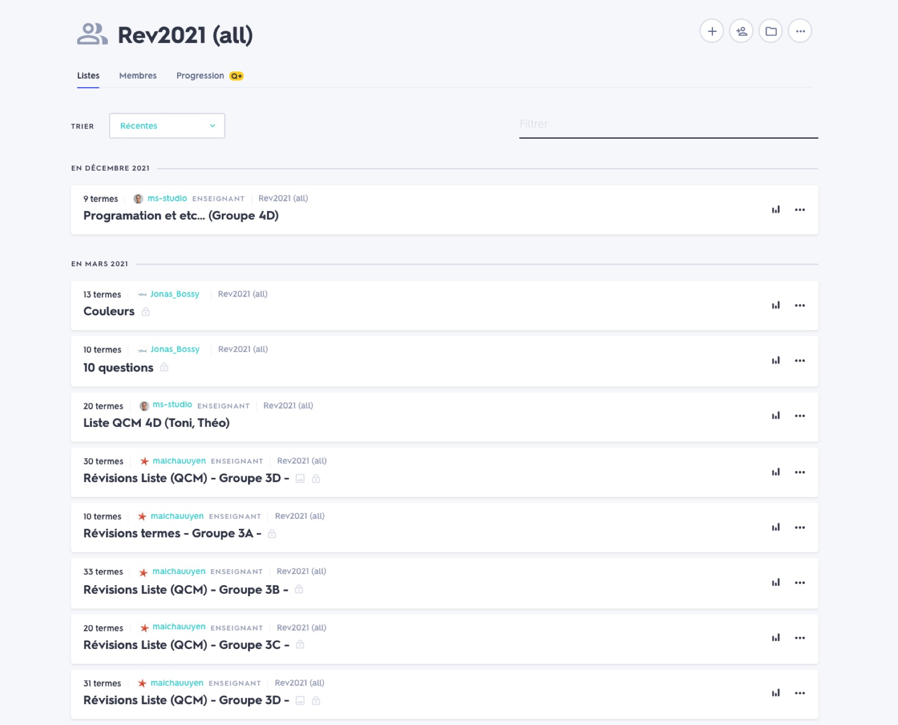
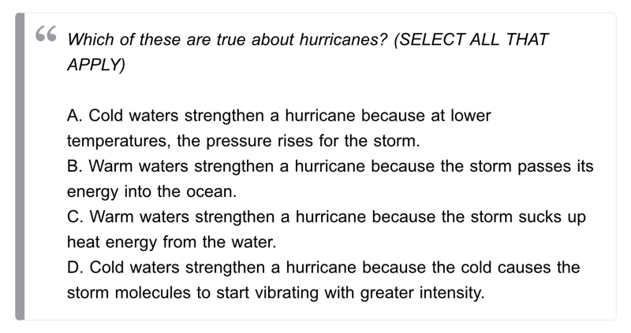
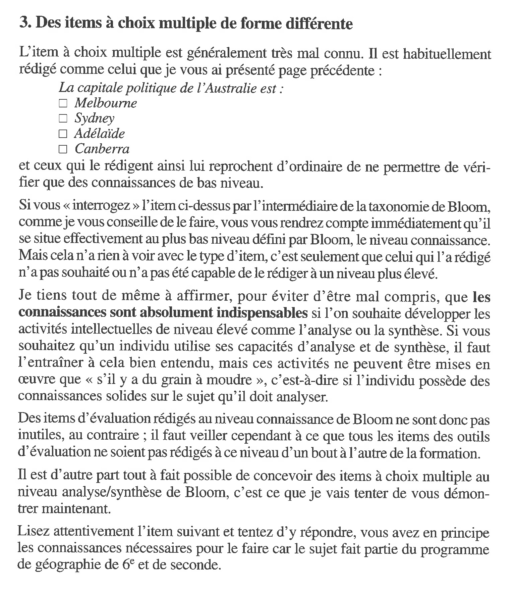
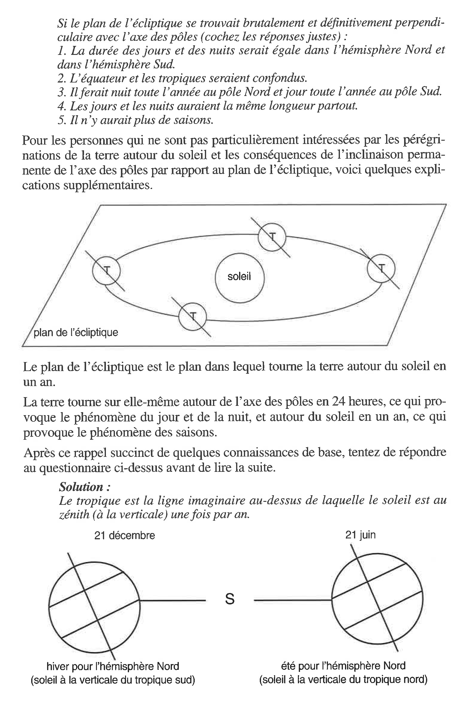
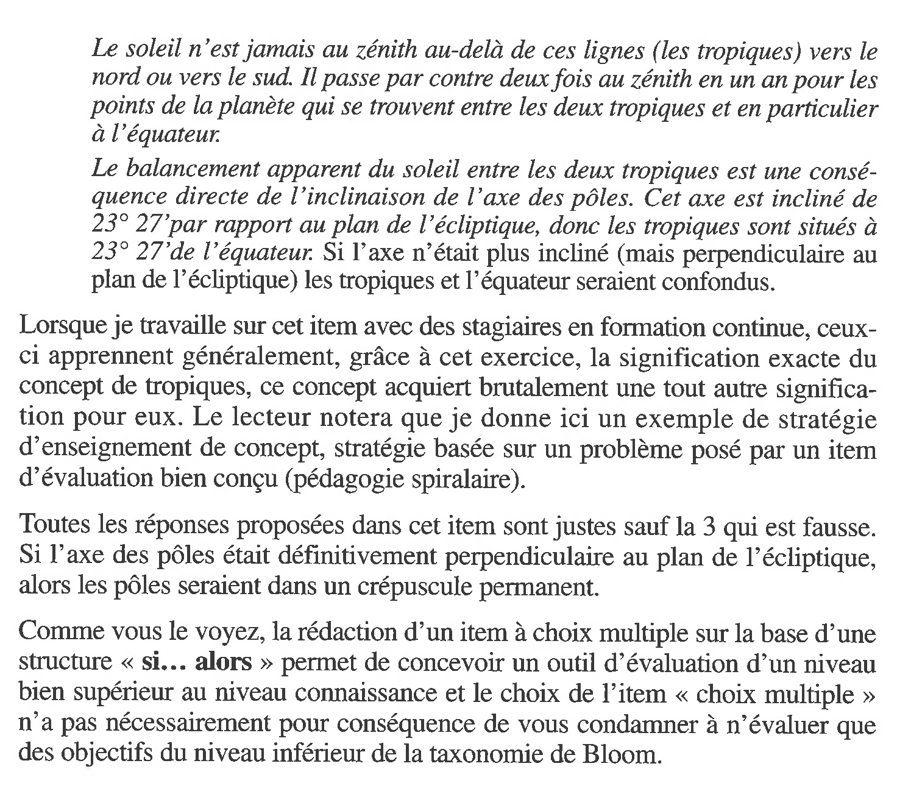
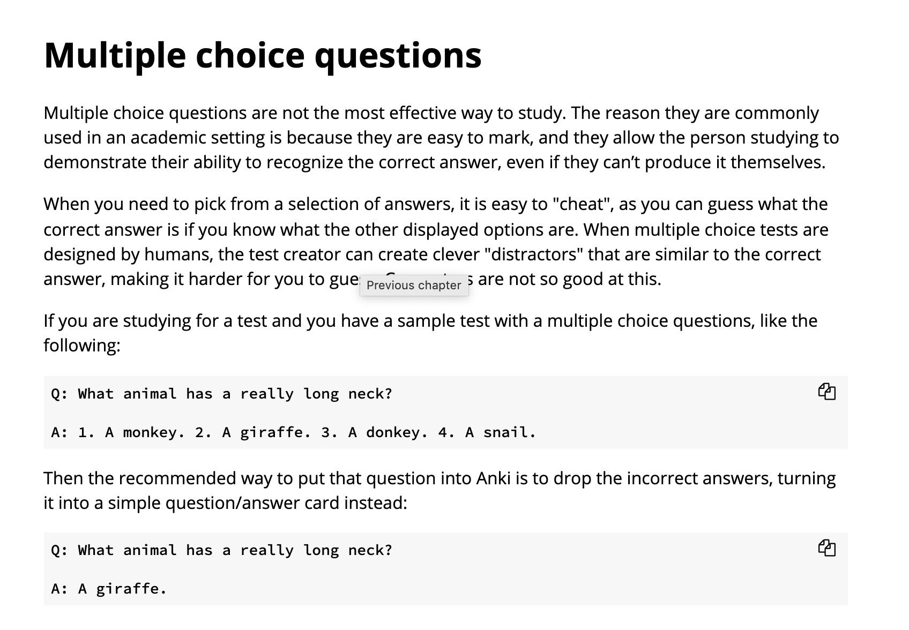

Première phase : création de questionnaire

Ce qui est demandé aux élèves:

Chaque binôme créera dans Quizlet :
*	Une liste avec minimum 20 questions QCM avec 4 réponses possibles (dont une correcte) touchant à tous les domaines. 
*	Une liste avec minimum 10 questions “définitions de termes”. 5 questions dans un domaine précis, puis 5 sur les 5 autres thèmes à choix.

Le travail effectué pour cette étape (production des listes de questions) fait l’objet d’une note. Les critéres sont les suivants:
*	Exhaustivité (quantité des questions).
*	Soin de rédaction, formulation bien pensée.
*	Degré de difficulté approprié.

## Exemples de questionnaires produits

Cette classe Quizlet rassemble des questionnaires produits par des élèves: [https://quizlet.com/class/17036438/](https://quizlet.com/class/17036438/)

## Conseils pour la création des questions

Si les questions ne sont pas bien conçues, elles ne testeront qu'un savoir superficiel de mémorisation de vocabulaire, et pas de compréhension plus profonde.

### Recommandations de Podsie

Les ressources pédagogiques de l'outil Podsie comportent une page de conseils sur la formulation de questions: *[Write Good Questions](https://podsie.tawk.help/article/write-good-questions)*.

Une recommandation consiste à opter pour le format "Select All That Apply" (Choisir toutes les réponses qui s'appliquent):

### Rédaction d'un item à choix multiple

Voici un extrait du livre d'Alain Rieunier, *Préparer un cours* (2001). Rieunier montre qu'un item à choix multiple bien conçu permet d'évaluer un niveau cognitif supérieur.

Voici [ces pages en PDF](pdf/Rieunier-questions-QCM.pdf) pour les distribuer aux élèves.

### Limites des QCM

La documentation de l'outil de révision Anki considère que les QCM facilitent la correction, mais ne sont pas la meilleure manière d'apprendre, puisque les réponses sont suggérées. L'exemple donné propose un très bas niveau cognitif.

Source: [https://faqs.ankiweb.net/multiple-choice-questions.html](https://faqs.ankiweb.net/multiple-choice-questions.html)