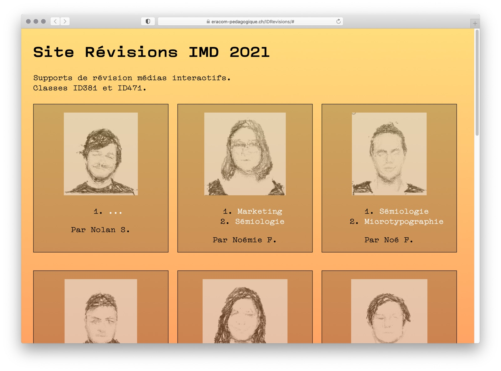

Tâche 3: Production de fiches récapitulatives sur un sujet précis

Consigne pour cette dernière phase:

Produire deux fiches récapitulatives sur les matières identifiées lors de l'auto-évaluation.

Les matières sont attribuées par l’enseignant, en se basant sur l’auto-évaluation faite par l’élève: on va lui attribuer une matière qu’il souhaite renforcer.

la fiche produite est diffusée aux deux classes. Un site internet sera créé pour faciliter le partage des fiches.

La réalisation de ces deux fiches fait l’objet d’une note.

## Exemples de fiches produites:

Ces site dédiés rassemblent des fiches créées par des élèves :

- [https://eracom-id471.github.io/revisions/](https://eracom-id471.github.io/revisions/) : fiches de la classe ID471.
- [https://eracom-pedagogique.ch/IDRevisions/](https://eracom-pedagogique.ch/IDRevisions/) : fiches de la classe ID381.
- Exemple de fiche : [Marketing mix](fiches/marketing-mix.pdf)
- Exemple de fiche : [Codecs et pixels](fiches/codecs-pixels.pdf)

