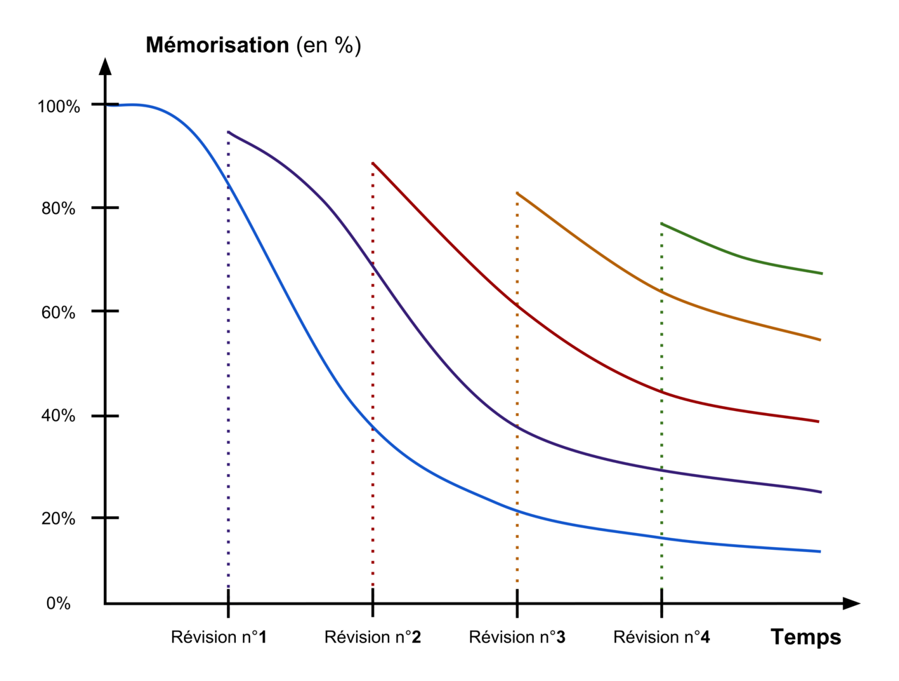

Informations sur le fonctionnement de la mémoire.

Pour toute personne en apprentissage, il est utile d'avoir une compréhension de la manière dont le cerveau humain emmagasine les nouvelles connaissances. La capacité de mémorisation est particulièrement importante.

La **courbe de l'oubli** a été mesurée déjà au 19e siècle par Hermann Ebbinghaus. Elle a été confirmée par la recherche actuelle, qui montre que 70% des informations sont oubliées après une journée.

Pour ancrer un savoir dans notre mémoire de manière durable, les "retrieval practice" sont l'une des méthodes les plus efficaces. Plutôt que de relire un texte, il faut se confronter à des **questions** qui obligent à *reformuler*, c'est à dire à extraire (retrieve) l'information de votre mémoire.

[Cette présentation Google Slides](https://docs.google.com/presentation/d/1AUgOeJnIlR5ASpQVlO7k099FE7-EhjC9Mn5WNv2u16A/edit?usp=sharing) donne une introduction pour les élèves aux notions de "courbe de l'oubli", "retrieval practice" et "spaced practice".

<iframe src="https://docs.google.com/presentation/d/e/2PACX-1vQcnsF2VN56Ede6E035RxwoDILcHOAROxnVUg-0Vj-R7GckowXmQLdK-OAFdA9K-FE7eusepRgr8OTK/embed?start=false&loop=false&delayms=10000" frameborder="0" width="100%" height="569" allowfullscreen="true" mozallowfullscreen="true" webkitallowfullscreen="true"></iframe>

## En savoir plus:

Quelques livres qui approfondissent ces questions:

- Brown, Peter C.; McDaniel, Mark A; Roediger, Henry L: *[Mets-toi ça dans la tête! : les stratégies d'apprentissages à la lumière des sciences cognitives](https://renouvaud1.primo.exlibrisgroup.com/permalink/41BCULAUSA_LIB/1bn1kna/alma991021090697902852)*, Genève : Markus Haller, 2016.
- Willingham, *Daniel T.: Why Don't Students Like School?*, San Francisco: Jossey-Bass, 2009.
- Jones, Kate: *Retrieval Practice*, Woodbridge: John Catt, 2019.

Références Wikipédia:

- [Courbe de l'oubli](https://fr.wikipedia.org/wiki/Courbe_de_l%27oubli) (Article Wikipédia)
- [Répétition espacée](https://fr.wikipedia.org/wiki/R%C3%A9p%C3%A9tition_espac%C3%A9e) (Article Wikipédia)